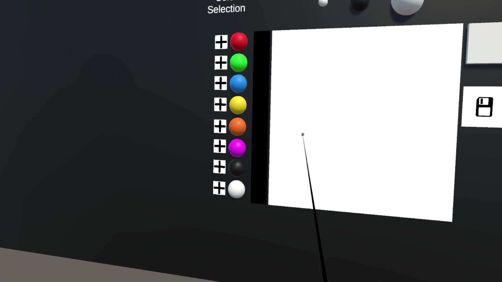
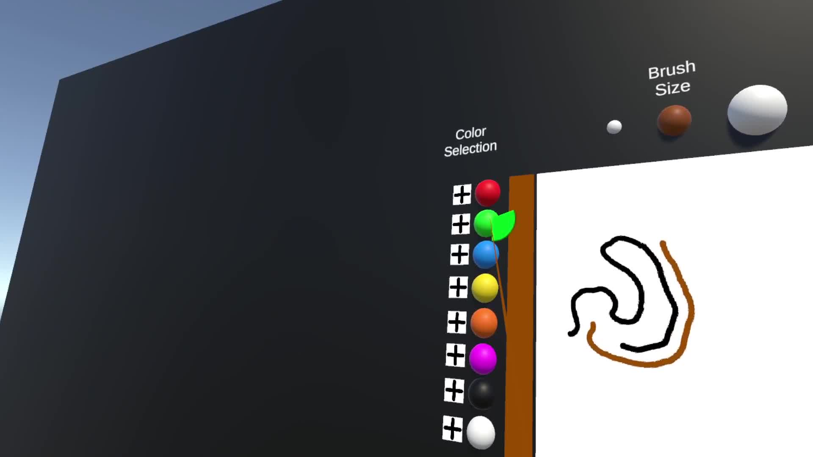
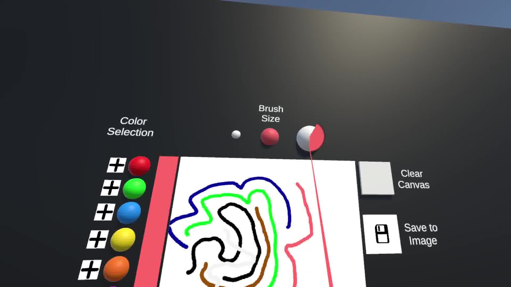

# VR Drawing App

 <!-- Replace with an actual image or banner -->

A virtual reality (VR) application that allows users to draw in 3D space using head movements and intuitive interactions. Built with Unity and designed for VR headsets like Oculus Quest 2.

---

## Table of Contents
1. [Features](#features)
2. [Technologies Used](#technologies-used)
3. [Installation](#installation)
4. [Usage](#usage)
5. [Screenshots](#screenshots)
6. [Contributing](#contributing)
7. [Acknowledgements](#acknowledgements)

---

## Features

- **Head-Based Drawing**: Draw in 3D space using head movements.
- **Gaze-Based Interaction**: Select colors, brush sizes, and other options by looking at interface elements. A progress indicator provides real-time feedback during selection.
- **Grab Button Toggle**: Use the grab button on the right controller to toggle drawing on and off, allowing for precise control over when to draw.
- **Color Selection**: Choose from a variety of colors and tones. Hover over the plus sign to reveal additional color tones.
- **Brush Size Control**: Adjust the brush size for finer or broader strokes using gaze-based selection.
- **Save Artwork**: Save your drawings as PNG images to your device.
- **Clear Canvas**: Reset the canvas with a single interaction.
- **Progress Indicator**: Visual feedback for actions like color selection and brush size adjustment.
- **Raycast Guidance**: A ray appears to help users aim when not drawing, enhancing precision and usability.

---

## Technologies Used

- **Unity**: Game engine for building the VR experience.
- **C#**: Scripting language for Unity.
- **OpenXR**: VR SDK for cross-platform VR support.
- **Oculus Integration**: For Oculus Quest compatibility.
- **Unity Input System**: For handling user input, including the grab button toggle.
- **Texture2D**: For canvas drawing and saving images.

---

## Installation

### Prerequisites
- Unity 2022.3.51f1 or later.
- Oculus Quest headset (or compatible VR device).
- Oculus PC app installed (for Oculus Link or Air Link).

### Steps
1. Clone the repository:
   ```bash
   git clone https://github.com/jpplf50/PaintWithHead-XR.git
2. Open the project in Unity.
3. Ensure the following packages are installed:
   - **OpenXR Plugin**
   - **XR Interaction Toolkit**
   - **Oculus Integration** (from the Unity Asset Store)
4. Connect your VR headset to your PC.
5. Build and run the project:
   - Go to **File > Build Settings**.
   - Select your target platform (e.g., PC, Mac, Linux Standalone).
   - Click **Build and Run**.

---

## Usage

1. **Launch the App**: Put on your VR headset and launch the application.
2. **Draw**: Use your head movements to draw on the canvas. Toggle drawing on and off using the grab button on the right controller.
3. **Change Colors**: Look at the color spheres to select a color. Hover over the plus sign to reveal additional tones.
4. **Adjust Brush Size**: Look at the brush size controls to change the brush size.
5. **Save Your Artwork**: Look at the save button to save your drawing as a PNG file.
6. **Clear Canvas**: Look at the clear button to reset the canvas.

---

## Screenshots

 <!-- Replace with actual screenshots -->








---

## Contributing

Contributions are welcome! If you'd like to contribute, please follow these steps:

1. Fork the repository.
2. Create a new branch (`git checkout -b feature/YourFeatureName`).
3. Commit your changes (`git commit -m 'Add some feature'`).
4. Push to the branch (`git push origin feature/YourFeatureName`).
5. Open a pull request.

---

## Acknowledgements

- **Unity Technologies** for the Unity engine.
- **Oculus** for the VR hardware and SDK.
- **OpenXR** for cross-platform VR support.

---

## Contact

For questions or feedback, feel free to reach out:

- **Email**: [jpferreira@lasige.di.fc.ul.pt]
- **GitHub**: [Your GitHub Profile](https://github.com/jpplf50)
- **Project**: [VR Drawing App](https://github.com/jpplf50/PaintWithHead-XR)

---

Enjoy drawing in VR! 🎨🖌️
